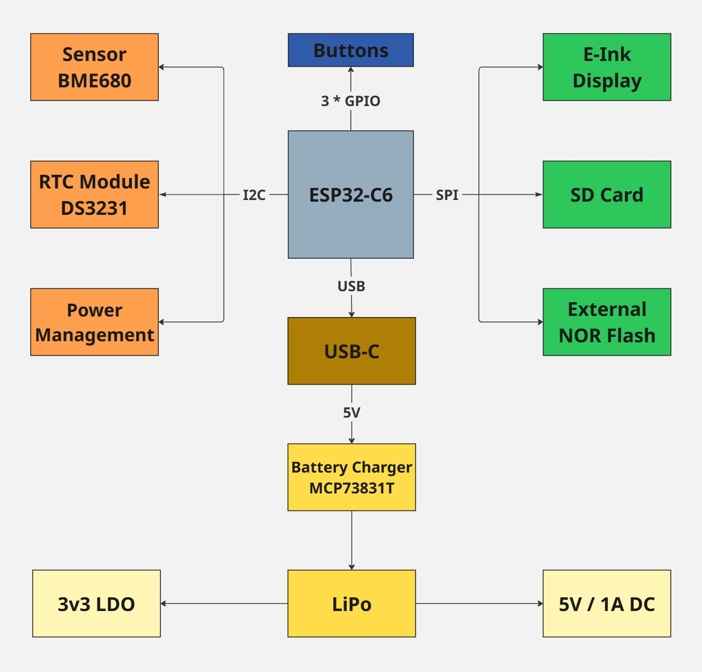

# TSC OpenBook Reader - Alexandru-Andrei CRET

## Project Content

+ **Schematic & PCB Design** → Circuit design files (.sch, .brd)

+ **Manufacturing Files** → Gerber files, Bill of Materials (BOM), and Pick & Place files.

+ **3D Model & Mechanical Design** → Complete 3D assembly of the device, including PCB, battery, display, and enclosure.

+ **Renders & Images** → Visual representations of the final device and PCB layout.

+ **Documentation** → In-depth explanation of hardware architecture, component connections, and design choices.

## Device Diagram

## Hardware Modules and Components

### ESP32-C6-WROOM-1-N8  (main microcontroller)
- **Key Features:** WiFi 6, Bluetooth 5 LE, RISC-V core
- **Operating Voltage:** 3.3V
- **Communication Interfaces:** SPI, I2C, UART, GPIO

### SD Card Module
- **Interface:** SPI
- **Pin Connections:**
  - `SS_SD` → `IO5`
  - `MOSI` → `IO23`
  - `MISO` → `IO19`
  - `SCK` → `IO18`

### Buttons (User Interface)
- **Interface:** GPIO
- **Pin Connections:**
  - `BUTTON_1` → `IO0` (Used for page turning)
  - `BUTTON_2` → `IO1` (Used for accessing menu options)

### E-Ink Display
- **Interface:** SPI
- **Pin Connections:**
  - `EPD_CS` → `IO15`
  - `EPD_DC` → `IO13`
  - `EPD_RST` → `IO12`
  - `EPD_BUSY` → `IO14`
  - `MOSI`, `SCK` shared with SD card module

### Voltage Regulator (LDO)
- **Purpose:** Converts 5V to 3.3V for powering the ESP32 and other peripherals

### Charging IC (TP4056)
- **Operating Voltage:** 5V via USB-C
- **Function:** Li-Po battery charging and protection

### USB Interface (USB-C Connector)
- **Functionality:** Power and data connection for the device
- **Protection:** ESD protection via TVS diodes

### Li-Po Battery
- **Type:** 3.7V Li-Po
- **Capacity:** 2000mAh

## Communication Interfaces

| **Interface** | **Connected Components** | **ESP32-C6 Pins**                         |
|---------------|--------------------------|-------------------------------------------|
| SPI           | E-Ink Display, SD Card   | `MOSI` (`IO23`), `MISO` (`IO19`), `SCK` (`IO18`) |
| I2C           | (Optional for sensors)   | `SDA` (`IO21`), `SCL` (`IO22`)           |
| GPIO          | Buttons, reset           | `IO0`, `IO1`                             |
| USB           | Power and Data (USB-C)   | `USB_D+` (`IO14`), `USB_D-` (`IO13`)     |

## Estimated Power Consumption

| Component             | Average Consumption (mA) |
| :--------------------- | :----------------------- |
| **Typical Total**      | **150-250 mA**          |
| E-Paper (in refresh)   | 20-50 mA               |
| SD Card                | 30-100 mA              |
| DS3231 RTC             | 0.2 mA                 |
| BME688                 | 0.8 mA                 |
| ESP32-C6 (WiFi active) | 80-160 mA              |
| External Flash         | 10-20 mA               |
| ESP32-C6 (idle)        | 10 mA                  |

## Bill of Materials (BOM)

| Component Name                                      | Link                | Datasheet                        |
|--------------------------------------------------|-----------------------------------|-----------------------------------|
| BD5229G-TR                                       | [Component Search Engine](https://componentsearchengine.com/part-view/BD5229G-TR/ROHM%20Semiconductor)         | [Datasheet](https://datasheet.datasheetarchive.com/originals/distributors/Datasheets_SAMA/f2b9741ef86007909f138d561a359946.pdf)     |
| ESP32 WROVER 0805 Capacitor                      | [Mouser](https://ro.mouser.com/ProductDetail/KYOCERA-AVX/SD0805S020S1R0?qs=jCA%252BPfw4LHbpkAoSnwrdjw%3D%3D)         | [Datasheet](https://ro.mouser.com/datasheet/2/40/schottky-3165252.pdf)     |
| ESP32 WROVER MCP73831 Power Management           | [Mouser](https://eu.mouser.com/ProductDetail/Microchip-Technology/MCP73831T-2ACI-OT?qs=yUQqVecv4qvbBQBGbHx0Mw%3D%3D)         | [Datasheet](https://eu.mouser.com/datasheet/2/268/MCP73831_Family_Data_Sheet_DS20001984H-3441711.pdf)     |
| PGB1010603MR Inductor                            | [SnapMagic](https://www.snapeda.com/parts/PGB1010603MR/Littelfuse/view-part/?ref=eda)         | [Datasheet](https://www.snapeda.com/parts/PGB1010603MR/Littelfuse%20Inc./datasheet/)     |
| USBLC6-2SC6Y USB Surge Protection                | [SnapMagic](https://www.snapeda.com/parts/USBLC6-2SC6Y/STMicroelectronics/view-part/?ref=eda)        | [Datasheet](https://www.snapeda.com/parts/USBLC6-2SC6Y/STMicroelectronics/datasheet/)     |
| CPH3225A                                         | [SnapMagic](https://www.snapeda.com/parts/CPH3225A/Seiko+Instruments/view-part/?ref=eda)         | [Datasheet](https://www.snapeda.com/parts/CPH3225A/Seiko%20Instruments/datasheet/)     |
| Capacitor 0402                                   | [Component Search Engine](https://componentsearchengine.com/part-view/CC0402MRX5R5BB106/YAGEO)         | [Datasheet](https://componentsearchengine.com/Datasheets/2/CC0402MRX5R5BB106.pdf)     |
| MAX17048G+T10 Battery Fuel Gauge                 | [SnapMagic](https://www.snapeda.com/parts/MAX17048G+T10/Analog+Devices/view-part/?ref=eda)         | [Datasheet](https://www.snapeda.com/parts/MAX17048G+T10/Analog%20Devices/datasheet/)     |
| USB4110-GF-A USB Hub                             | [Component Search Engine](https://componentsearchengine.com/part-view/USB4110-GF-A/GCT%20(GLOBAL%20CONNECTOR%20TECHNOLOGY))         | [Datasheet](https://gct.co/files/drawings/usb4110.pdf)     |
| ESP32-C6 WROOM-1-N8                              | [SnapMagic](https://www.snapeda.com/parts/ESP32-C6-WROOM-1-N8/Espressif+Systems/view-part/?ref=eda)         | [Datasheet](https://www.snapeda.com/parts/ESP32-C6-WROOM-1-N8/Espressif%20Systems/datasheet/)     |
| ESP32 WROVER BME680 Sensor                       | [SnapMagic](https://www.snapeda.com/parts/BME680/Bosch/view-part/?welcome=home)        | [Datasheet](https://www.snapeda.com/parts/BME680/Bosch%20Sensortec/datasheet/)     |
| SJ                                               | [GrabCad](https://grabcad.com/library/solder-jumpers-1)         | [Datasheet](https://www.youtube.com/watch?v=dQw4w9WgXcQ)     |
| RCL CPOL 3528                                    | [SnapMagic](https://www.snapeda.com/parts/TAJB475K025RNJ/AVX/view-part/?ref=dk&t=capacitor%203528&con_ref=None)        | [Datasheet](https://s3.amazonaws.com/snapeda/datasheet/TAJB475K025RNJ_AVX.pdf)     |
| ESP32C6 Varistor 1812                            | [Mouser](https://ro.mouser.com/ProductDetail/EPCOS-TDK/B72520T0350K062?qs=dEfas%2FXlABIszF52uu7vrg%3D%3D)        | [Datasheet](https://www.tdk-electronics.tdk.com/inf/75/db/CTVS_14/Surge_protection_series.pdf)     |
| LED Chip 0603                                    | [SnapMagic](https://www.snapeda.com/parts/KP-1608SURCK/Kingbright/view-part/?ref=search&t=LED%200603)        | [Datasheet](https://www.snapeda.com/parts/KP-1608SURCK/Kingbright/datasheet/)     |
| DS3231SN RTC                                     | [SnapMagic](https://www.snapeda.com/parts/DS3231SN%23/Analog+Devices/view-part/?ref=eda)        | [Datasheet](https://www.snapeda.com/parts/DS3231SN%23/Analog%20Devices/datasheet/)     |
| TPTP20R                                          | [Comet](https://easyeda.com/component/7524403feb2642ac9f9f26dfb93ceacf)         | [Datasheet](https://easyeda.com/component/7524403feb2642ac9f9f26dfb93ceacf)     |
| FH34SRJ-24S-0.5SH Connector                      | [Component Search Engine](https://componentsearchengine.com/part-view/FH34SRJ-24S-0.5SH(99)/Hirose)        | [Datasheet](https://www.hirose.com/en/product/document?clcode=CL0580-1255-6-99&productname=FH34SRJ-24S-0.5SH(99)&series=FH34SRJ&documenttype=2DDrawing&lang=en&documentid=0000990903)     |
| QWIIC Connector                                  | [Mouser](https://eu.mouser.com/ProductDetail/Adafruit/4208?qs=PzGy0jfpSMtbScLbr0L5dw%3D%3D)        | [Datasheet](https://www.youtube.com/watch?v=dQw4w9WgXcQ)     |
| MBR0530 Schottky Diode                           | [SnapMagic](https://www.snapeda.com/parts/MBR0530/Onsemi/view-part/?ref=eda)        | [Datasheet](https://www.snapeda.com/parts/MBR0530/ON%20Semiconductor/datasheet/)     |
| XC6220A331MR-G Voltage Regulator                 | [Component Search Engine](https://componentsearchengine.com/part-view/XC6220A331MR-G/Torex)        | [Datasheet](https://product.torexsemi.com/system/files/series/xc6220.pdf)     |
| SI1308EDL-T1-GE3 MOSFET                          | [SnapMagic](https://www.snapeda.com/parts/SI1308EDL-T1-GE3/Vishay+Siliconix/view-part/?ref=eda)        | [Datasheet](https://www.youtube.com/watch?v=dQw4w9WgXcQ)     |
| 112A-TAAR-R03                                    | [Comet](https://store.comet.srl.ro/Catalogue/Product/43497/)         | [Datasheet](https://store.comet.bg/download-file.php?id=27596)     |
| ESP32 WROVER P-Channel MOSFET                    | [Component Search Engine](https://componentsearchengine.com/part-view/DMG2305UX-7/Diodes%20Incorporated)         | [Datasheet](https://www.diodes.com//assets/Datasheets/DMG2305UX.pdf)     |
